# Screens / صفحه‌ها

Figma: https://www.figma.com/design/1VzYLeeic0ExwgdWt7RbVw — **110 screens** (8 added after the 2026-09-28 audit: cancelled dishes IP1–IP4, C1b, C8b, W6b, S4b; then W12 and W12b, the loud "food is ready" alert on the waiter's phone). Every screen links to its frame. Overview images are in [`design/`](../design/).

🆕 = added in design v1.1 (2026-09-28) · ✏️ = changed in v1.1 (Sofrexa branding, password login, loyalty points).

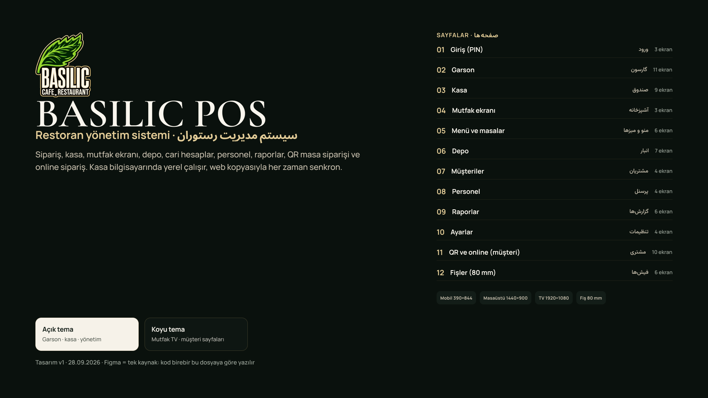

## 01 · Giriş (PIN) · ورود

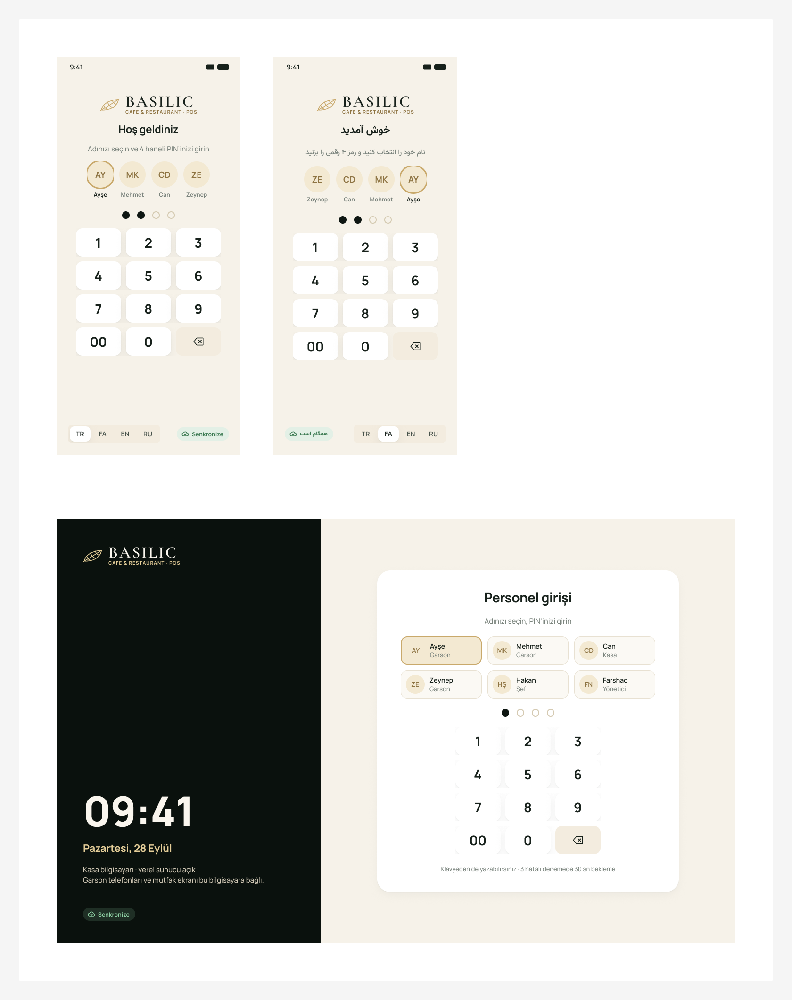

| Code | Screen | Figma |
|---|---|---|
| L1 ✏️ | PIN girişi · Mobile | [open](https://www.figma.com/design/1VzYLeeic0ExwgdWt7RbVw?node-id=13-2) |
| L2 ✏️ | PIN girişi — FA (RTL) · Mobile | [open](https://www.figma.com/design/1VzYLeeic0ExwgdWt7RbVw?node-id=13-100) |
| L3 ✏️ | PIN girişi · Desktop (kasa PC) | [open](https://www.figma.com/design/1VzYLeeic0ExwgdWt7RbVw?node-id=15-115) |

## 02 · Garson · گارسون

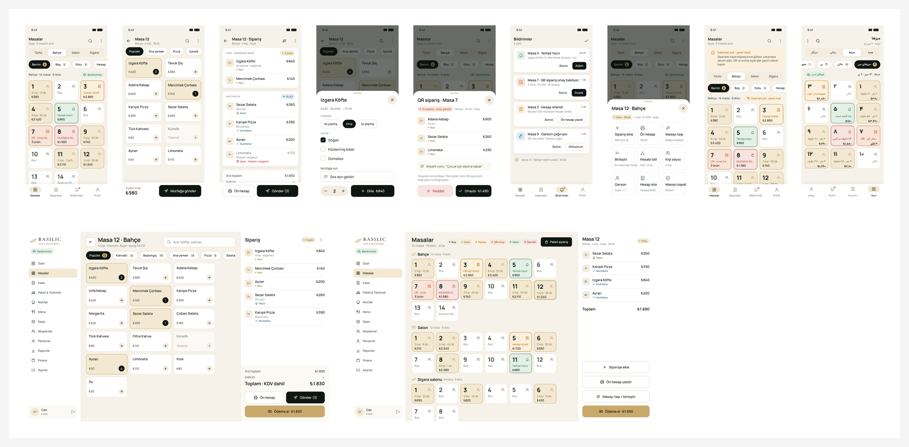

| Code | Screen | Figma |
|---|---|---|
| W1 | Masalar · Mobile | [open](https://www.figma.com/design/1VzYLeeic0ExwgdWt7RbVw?node-id=17-2) |
| W2 | Sipariş al (menü) · Mobile | [open](https://www.figma.com/design/1VzYLeeic0ExwgdWt7RbVw?node-id=18-164) |
| W3 | Sipariş özeti · Mobile | [open](https://www.figma.com/design/1VzYLeeic0ExwgdWt7RbVw?node-id=18-295) |
| W4 | Ürün seçenekleri (sheet) · Mobile | [open](https://www.figma.com/design/1VzYLeeic0ExwgdWt7RbVw?node-id=19-351) |
| W5 | QR sipariş onayı (sheet) · Mobile | [open](https://www.figma.com/design/1VzYLeeic0ExwgdWt7RbVw?node-id=19-443) |
| W6 | Bildirimler · Mobile | [open](https://www.figma.com/design/1VzYLeeic0ExwgdWt7RbVw?node-id=20-675) |
| W7 | Masa işlemleri (sheet) · Mobile | [open](https://www.figma.com/design/1VzYLeeic0ExwgdWt7RbVw?node-id=20-804) |
| W8 | Masalar — فارسی (RTL) · Mobile | [open](https://www.figma.com/design/1VzYLeeic0ExwgdWt7RbVw?node-id=21-1085) |
| W9 | Masalar — internet yok (yerel mod) · Mobile | [open](https://www.figma.com/design/1VzYLeeic0ExwgdWt7RbVw?node-id=20-912) |
| W10 | Sipariş al · Desktop (kasa/tablet) | [open](https://www.figma.com/design/1VzYLeeic0ExwgdWt7RbVw?node-id=22-1214) |
| W11 | Masalar (tüm bölümler) · Desktop | [open](https://www.figma.com/design/1VzYLeeic0ExwgdWt7RbVw?node-id=23-1550) |
| W6b 🆕 | Bildirimler — iptal ve yazıcı · Mobile (on the Kasa page) | [open](https://www.figma.com/design/1VzYLeeic0ExwgdWt7RbVw?node-id=135-2085) |
| W12 🆕 | Hazır uyarısı (tam ekran, sesli) · Mobile | [open](https://www.figma.com/design/1VzYLeeic0ExwgdWt7RbVw?node-id=143-1951) |
| W12b 🆕 | Hazır uyarısı · Desktop | [open](https://www.figma.com/design/1VzYLeeic0ExwgdWt7RbVw?node-id=146-1964) |

## 03 · Kasa · صندوق

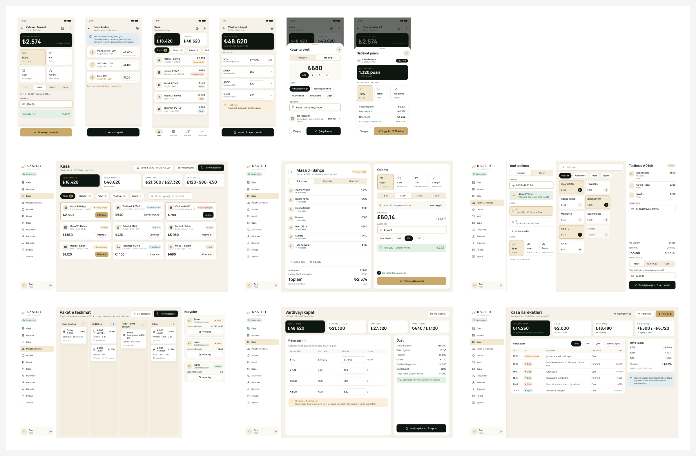

| Code | Screen | Figma |
|---|---|---|
| C1 | Kasa — açık siparişler · Desktop | [open](https://www.figma.com/design/1VzYLeeic0ExwgdWt7RbVw?node-id=24-2) |
| C2 | Ödeme (döviz) · Desktop | [open](https://www.figma.com/design/1VzYLeeic0ExwgdWt7RbVw?node-id=26-232) |
| C3 | Ödeme · Mobile | [open](https://www.figma.com/design/1VzYLeeic0ExwgdWt7RbVw?node-id=26-557) |
| C4 | Telefon siparişi (teslimat) · Desktop | [open](https://www.figma.com/design/1VzYLeeic0ExwgdWt7RbVw?node-id=27-491) |
| C5 | Teslimatlar & kuryeler · Desktop | [open](https://www.figma.com/design/1VzYLeeic0ExwgdWt7RbVw?node-id=28-741) |
| C6 | Vardiya kapat / gün sonu · Desktop | [open](https://www.figma.com/design/1VzYLeeic0ExwgdWt7RbVw?node-id=28-1008) |
| C7 | Döviz kurları · Mobile | [open](https://www.figma.com/design/1VzYLeeic0ExwgdWt7RbVw?node-id=27-832) |
| C8 | Kasa — açık siparişler · Mobile | [open](https://www.figma.com/design/1VzYLeeic0ExwgdWt7RbVw?node-id=29-970) |
| C9 | Vardiya kapat · Mobile | [open](https://www.figma.com/design/1VzYLeeic0ExwgdWt7RbVw?node-id=29-1116) |
| C10 🆕 | Kasa hareketleri · Desktop | [open](https://www.figma.com/design/1VzYLeeic0ExwgdWt7RbVw?node-id=85-1082) |
| C11 🆕 | Kasadan para çıkışı (sheet) · Mobile | [open](https://www.figma.com/design/1VzYLeeic0ExwgdWt7RbVw?node-id=85-1556) |
| C12 🆕 | Sadakat puanı kullan (sheet) · Mobile | [open](https://www.figma.com/design/1VzYLeeic0ExwgdWt7RbVw?node-id=85-1758) |
| IP1 🆕 | Hazır iptaller · Desktop | [open](https://www.figma.com/design/1VzYLeeic0ExwgdWt7RbVw?node-id=128-1409) |
| IP2 🆕 | Hazır iptaller · Mobile | [open](https://www.figma.com/design/1VzYLeeic0ExwgdWt7RbVw?node-id=133-1742) |
| IP3 🆕 | Masaya ver (sheet) · Mobile | [open](https://www.figma.com/design/1VzYLeeic0ExwgdWt7RbVw?node-id=133-10508) |
| IP4 🆕 | Personele yaz (sheet) · Mobile | [open](https://www.figma.com/design/1VzYLeeic0ExwgdWt7RbVw?node-id=134-1987) |
| C1b 🆕 | Kasa — iptal uyarısı · Desktop | [open](https://www.figma.com/design/1VzYLeeic0ExwgdWt7RbVw?node-id=128-1528) |
| C8b 🆕 | Kasa — iptal uyarısı · Mobile | [open](https://www.figma.com/design/1VzYLeeic0ExwgdWt7RbVw?node-id=133-10367) |

## 04 · Mutfak · آشپزخانه

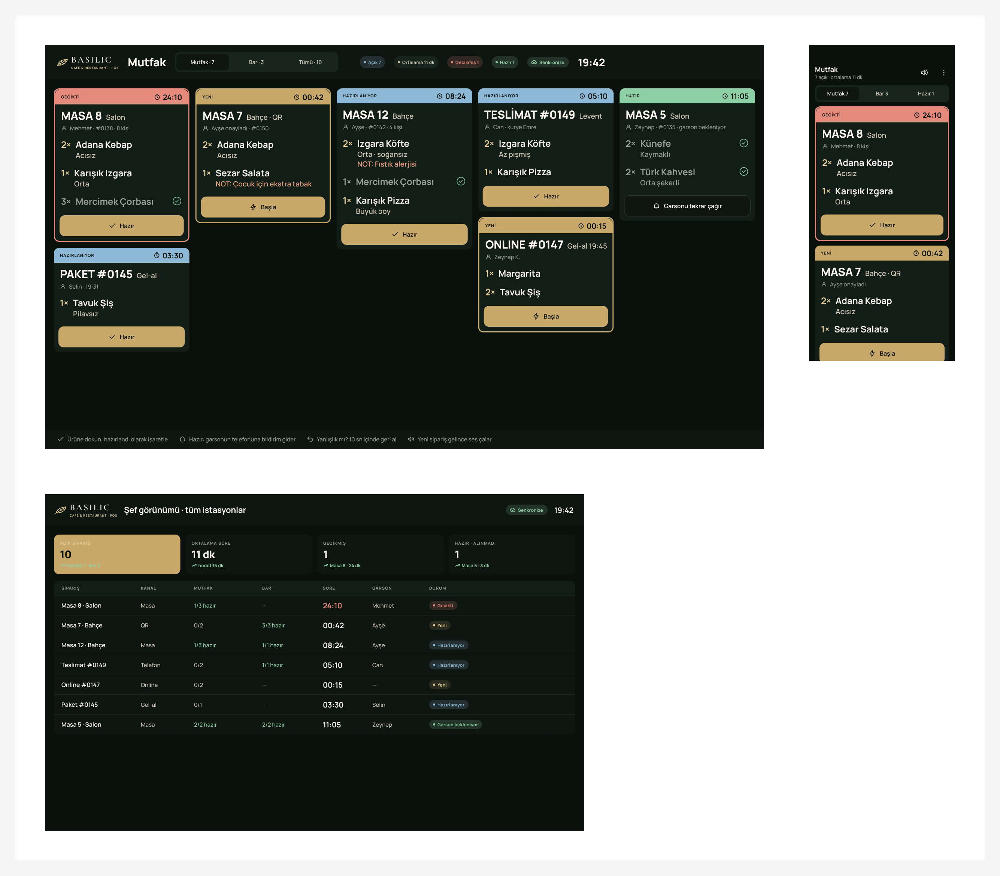

| Code | Screen | Figma |
|---|---|---|
| K1 | Mutfak ekranı · TV 1920×1080 | [open](https://www.figma.com/design/1VzYLeeic0ExwgdWt7RbVw?node-id=30-2) |
| K2 | Şef (mobil) · Mobile | [open](https://www.figma.com/design/1VzYLeeic0ExwgdWt7RbVw?node-id=31-240) |
| K3 | Şef görünümü (tüm istasyonlar) · Desktop | [open](https://www.figma.com/design/1VzYLeeic0ExwgdWt7RbVw?node-id=31-340) |

## 05 · Menü ve masalar · منو و میزها

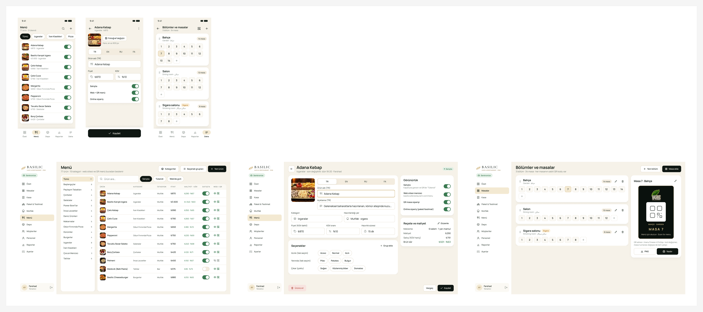

| Code | Screen | Figma |
|---|---|---|
| M1 | Menü ürünleri · Desktop | [open](https://www.figma.com/design/1VzYLeeic0ExwgdWt7RbVw?node-id=34-2) |
| M2 | Ürün düzenle · Desktop | [open](https://www.figma.com/design/1VzYLeeic0ExwgdWt7RbVw?node-id=35-251) |
| M3 | Menü · Mobile | [open](https://www.figma.com/design/1VzYLeeic0ExwgdWt7RbVw?node-id=34-444) |
| M4 | Ürün düzenle · Mobile | [open](https://www.figma.com/design/1VzYLeeic0ExwgdWt7RbVw?node-id=35-560) |
| M5 | Bölümler ve masalar (QR) · Desktop | [open](https://www.figma.com/design/1VzYLeeic0ExwgdWt7RbVw?node-id=36-466) |
| M6 | Bölümler ve masalar · Mobile | [open](https://www.figma.com/design/1VzYLeeic0ExwgdWt7RbVw?node-id=36-756) |
| M7 🆕 | Fiyat ve stok (hızlı düzenleme) · Desktop | [open](https://www.figma.com/design/1VzYLeeic0ExwgdWt7RbVw?node-id=80-658) |
| M8 🆕 | Fiyat ve stok · Mobile | [open](https://www.figma.com/design/1VzYLeeic0ExwgdWt7RbVw?node-id=80-1274) |

## 06 · Depo · انبار

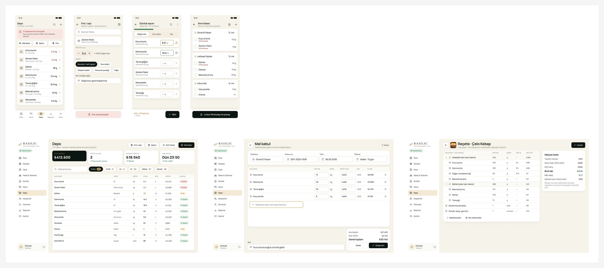

| Code | Screen | Figma |
|---|---|---|
| S1 | Depo — stok durumu · Desktop | [open](https://www.figma.com/design/1VzYLeeic0ExwgdWt7RbVw?node-id=37-2) |
| S2 | Mal kabul (alış faturası) · Desktop | [open](https://www.figma.com/design/1VzYLeeic0ExwgdWt7RbVw?node-id=38-341) |
| S3 | Sayım (stok sayımı) · Mobile | [open](https://www.figma.com/design/1VzYLeeic0ExwgdWt7RbVw?node-id=39-529) |
| S4 | Fire / zayi · Mobile | [open](https://www.figma.com/design/1VzYLeeic0ExwgdWt7RbVw?node-id=38-606) |
| S4b 🆕 | Fire / zayi — hazır iptaller · Mobile | [open](https://www.figma.com/design/1VzYLeeic0ExwgdWt7RbVw?node-id=138-709) |
| S5 | Reçete ve maliyet · Desktop | [open](https://www.figma.com/design/1VzYLeeic0ExwgdWt7RbVw?node-id=39-722) |
| S6 | Depo · Mobile | [open](https://www.figma.com/design/1VzYLeeic0ExwgdWt7RbVw?node-id=37-386) |
| S7 | Alım listesi · Mobile | [open](https://www.figma.com/design/1VzYLeeic0ExwgdWt7RbVw?node-id=39-625) |

## 07 · Müşteriler · مشتریان

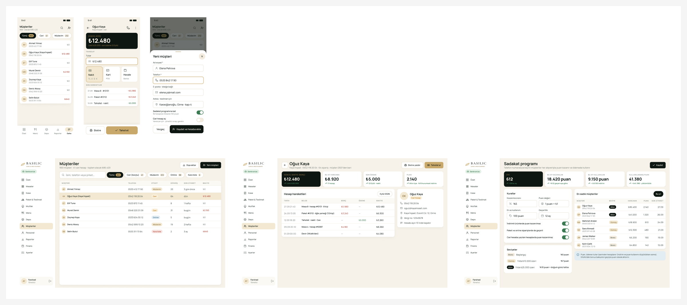

| Code | Screen | Figma |
|---|---|---|
| CU1 | Müşteriler · Desktop | [open](https://www.figma.com/design/1VzYLeeic0ExwgdWt7RbVw?node-id=41-2) |
| CU2 ✏️ | Müşteri hesabı (cari) · Desktop | [open](https://www.figma.com/design/1VzYLeeic0ExwgdWt7RbVw?node-id=41-307) |
| CU3 | Müşteriler · Mobile | [open](https://www.figma.com/design/1VzYLeeic0ExwgdWt7RbVw?node-id=41-526) |
| CU4 | Müşteri hesabı + tahsilat · Mobile | [open](https://www.figma.com/design/1VzYLeeic0ExwgdWt7RbVw?node-id=41-652) |
| CU5 🆕 | Sadakat programı · Desktop | [open](https://www.figma.com/design/1VzYLeeic0ExwgdWt7RbVw?node-id=81-425) |
| CU6 🆕 | Yeni müşteri (sheet) · Mobile | [open](https://www.figma.com/design/1VzYLeeic0ExwgdWt7RbVw?node-id=81-888) |
| CU7 🆕 | Müşteri seviyesi (sheet) · Mobile | [open](https://www.figma.com/design/1VzYLeeic0ExwgdWt7RbVw?node-id=103-743) |

## 08 · Personel · پرسنل

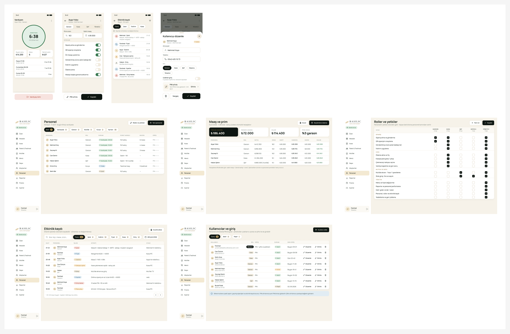

| Code | Screen | Figma |
|---|---|---|
| ST1 | Personel · Desktop | [open](https://www.figma.com/design/1VzYLeeic0ExwgdWt7RbVw?node-id=42-2) |
| ST2 | Maaş ve prim · Desktop | [open](https://www.figma.com/design/1VzYLeeic0ExwgdWt7RbVw?node-id=42-312) |
| ST3 | Vardiya giriş/çıkış · Mobile | [open](https://www.figma.com/design/1VzYLeeic0ExwgdWt7RbVw?node-id=42-508) |
| ST4 | Personel düzenle + yetkiler · Mobile | [open](https://www.figma.com/design/1VzYLeeic0ExwgdWt7RbVw?node-id=42-569) |
| ST5 🆕 | Roller ve yetkiler · Desktop | [open](https://www.figma.com/design/1VzYLeeic0ExwgdWt7RbVw?node-id=93-354) |
| ST6 🆕 | Etkinlik kaydı · Desktop | [open](https://www.figma.com/design/1VzYLeeic0ExwgdWt7RbVw?node-id=93-813) |
| ST7 🆕 | Etkinlik kaydı · Mobile | [open](https://www.figma.com/design/1VzYLeeic0ExwgdWt7RbVw?node-id=93-1214) |
| ST8 🆕 | Kullanıcılar ve giriş · Desktop | [open](https://www.figma.com/design/1VzYLeeic0ExwgdWt7RbVw?node-id=104-836) |
| ST9 🆕 | Kullanıcı düzenle (sheet) · Mobile | [open](https://www.figma.com/design/1VzYLeeic0ExwgdWt7RbVw?node-id=104-1339) |

## 09 · Raporlar · گزارش‌ها

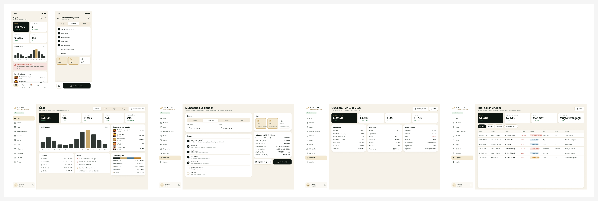

| Code | Screen | Figma |
|---|---|---|
| R1 | Yönetici özeti · Mobile | [open](https://www.figma.com/design/1VzYLeeic0ExwgdWt7RbVw?node-id=43-2) |
| R2 | Özet paneli · Desktop | [open](https://www.figma.com/design/1VzYLeeic0ExwgdWt7RbVw?node-id=43-166) |
| R3 | Gün sonu raporu · Desktop | [open](https://www.figma.com/design/1VzYLeeic0ExwgdWt7RbVw?node-id=44-599) |
| R4 | Muhasebeci dışa aktarım · Desktop | [open](https://www.figma.com/design/1VzYLeeic0ExwgdWt7RbVw?node-id=44-258) |
| R5 | Muhasebeci dışa aktarım · Mobile | [open](https://www.figma.com/design/1VzYLeeic0ExwgdWt7RbVw?node-id=44-508) |
| R6 | İptal edilen ürünler (denetim) · Desktop | [open](https://www.figma.com/design/1VzYLeeic0ExwgdWt7RbVw?node-id=54-536) |
| R7 🆕 | Personel performansı · Desktop | [open](https://www.figma.com/design/1VzYLeeic0ExwgdWt7RbVw?node-id=90-683) |
| R8 🆕 | Personel performansı · Mobile | [open](https://www.figma.com/design/1VzYLeeic0ExwgdWt7RbVw?node-id=90-1177) |

## 10 · Ayarlar · تنظیمات

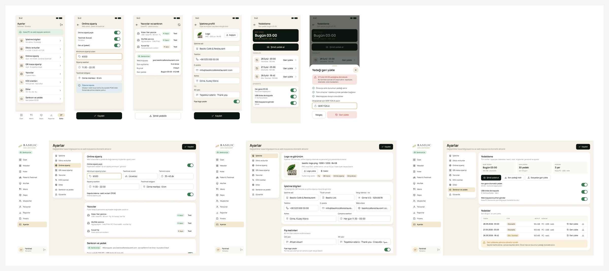

| Code | Screen | Figma |
|---|---|---|
| SE1 | Ayarlar · Desktop | [open](https://www.figma.com/design/1VzYLeeic0ExwgdWt7RbVw?node-id=45-2) |
| SE2 | Ayarlar · Mobile | [open](https://www.figma.com/design/1VzYLeeic0ExwgdWt7RbVw?node-id=45-333) |
| SE3 | Online sipariş ayarları · Mobile | [open](https://www.figma.com/design/1VzYLeeic0ExwgdWt7RbVw?node-id=45-490) |
| SE4 | Yazıcılar ve senkron · Mobile | [open](https://www.figma.com/design/1VzYLeeic0ExwgdWt7RbVw?node-id=45-566) |
| SE5 🆕 | İşletme profili · Desktop | [open](https://www.figma.com/design/1VzYLeeic0ExwgdWt7RbVw?node-id=77-406) |
| SE6 🆕 | İşletme profili · Mobile | [open](https://www.figma.com/design/1VzYLeeic0ExwgdWt7RbVw?node-id=78-710) |
| SE7 🆕 | Yedekleme ve geri yükleme · Desktop | [open](https://www.figma.com/design/1VzYLeeic0ExwgdWt7RbVw?node-id=77-776) |
| SE8 🆕 | Yedekleme · Mobile | [open](https://www.figma.com/design/1VzYLeeic0ExwgdWt7RbVw?node-id=78-794) |
| SE9 🆕 | Geri yükleme onayı (sheet) · Mobile | [open](https://www.figma.com/design/1VzYLeeic0ExwgdWt7RbVw?node-id=78-878) |

## 11 · QR ve online (müşteri) · مشتری

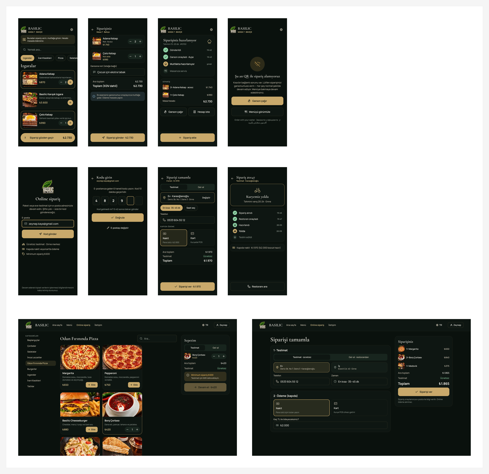

| Code | Screen | Figma |
|---|---|---|
| O1 ✏️ | Online giriş (e-posta + şifre) · Mobile | [open](https://www.figma.com/design/1VzYLeeic0ExwgdWt7RbVw?node-id=48-142) |
| O2 ✏️ | E-posta doğrulama (kayıt 2/2) · Mobile | [open](https://www.figma.com/design/1VzYLeeic0ExwgdWt7RbVw?node-id=48-181) |
| O3 | Sipariş tamamla · Mobile | [open](https://www.figma.com/design/1VzYLeeic0ExwgdWt7RbVw?node-id=48-222) |
| O4 | Sipariş takibi · Mobile | [open](https://www.figma.com/design/1VzYLeeic0ExwgdWt7RbVw?node-id=48-302) |
| O5 | Online menü + sepet · Desktop | [open](https://www.figma.com/design/1VzYLeeic0ExwgdWt7RbVw?node-id=50-223) |
| O6 | Sipariş tamamla · Desktop | [open](https://www.figma.com/design/1VzYLeeic0ExwgdWt7RbVw?node-id=50-392) |
| O7 🆕 | Kayıt ol (1/2) · Mobile | [open](https://www.figma.com/design/1VzYLeeic0ExwgdWt7RbVw?node-id=87-360) |
| O8 🆕 | Şifremi unuttum · Mobile | [open](https://www.figma.com/design/1VzYLeeic0ExwgdWt7RbVw?node-id=87-446) |
| O9 🆕 | Giriş / kayıt · Desktop | [open](https://www.figma.com/design/1VzYLeeic0ExwgdWt7RbVw?node-id=88-391) |
| Q1 | QR menü (Masa 7) · Mobile | [open](https://www.figma.com/design/1VzYLeeic0ExwgdWt7RbVw?node-id=46-2) |
| Q2 | QR sepet — gönder · Mobile | [open](https://www.figma.com/design/1VzYLeeic0ExwgdWt7RbVw?node-id=46-106) |
| Q3 | QR sipariş durumu · Mobile | [open](https://www.figma.com/design/1VzYLeeic0ExwgdWt7RbVw?node-id=47-108) |
| Q4 | QR sipariş geçici kapalı (internet yok) · Mobile | [open](https://www.figma.com/design/1VzYLeeic0ExwgdWt7RbVw?node-id=47-185) |

## 12 · Fişler 80 mm · فیش‌ها

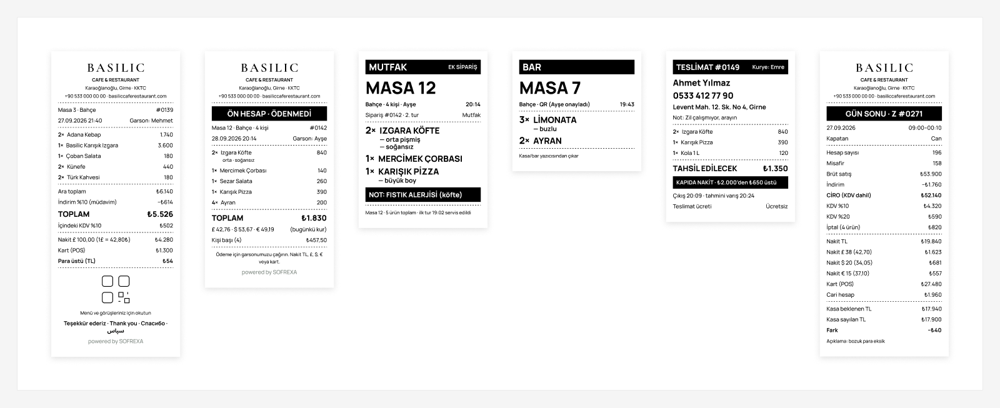

| Code | Screen | Figma |
|---|---|---|
| P1 ✏️ | Müşteri fişi (ödendi) · 80 mm | [open](https://www.figma.com/design/1VzYLeeic0ExwgdWt7RbVw?node-id=51-2) |
| P2 ✏️ | Ön hesap (adisyon) · 80 mm | [open](https://www.figma.com/design/1VzYLeeic0ExwgdWt7RbVw?node-id=51-70) |
| P3 | Mutfak fişi · 80 mm | [open](https://www.figma.com/design/1VzYLeeic0ExwgdWt7RbVw?node-id=51-124) |
| P4 | Bar fişi · 80 mm | [open](https://www.figma.com/design/1VzYLeeic0ExwgdWt7RbVw?node-id=51-154) |
| P5 | Kurye fişi · 80 mm | [open](https://www.figma.com/design/1VzYLeeic0ExwgdWt7RbVw?node-id=51-173) |
| P6 | Gün sonu (Z) raporu · 80 mm | [open](https://www.figma.com/design/1VzYLeeic0ExwgdWt7RbVw?node-id=51-209) |

## 13 · Finans · مالی

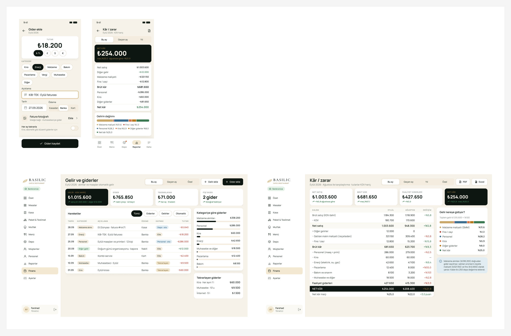

| Code | Screen | Figma |
|---|---|---|
| FI1 🆕 | Gelir ve giderler · Desktop | [open](https://www.figma.com/design/1VzYLeeic0ExwgdWt7RbVw?node-id=95-2) |
| FI2 🆕 | Gider ekle · Mobile | [open](https://www.figma.com/design/1VzYLeeic0ExwgdWt7RbVw?node-id=95-507) |
| FI3 🆕 | Kâr / zarar · Desktop | [open](https://www.figma.com/design/1VzYLeeic0ExwgdWt7RbVw?node-id=99-287) |
| FI4 🆕 | Kâr / zarar · Mobile | [open](https://www.figma.com/design/1VzYLeeic0ExwgdWt7RbVw?node-id=99-714) |
